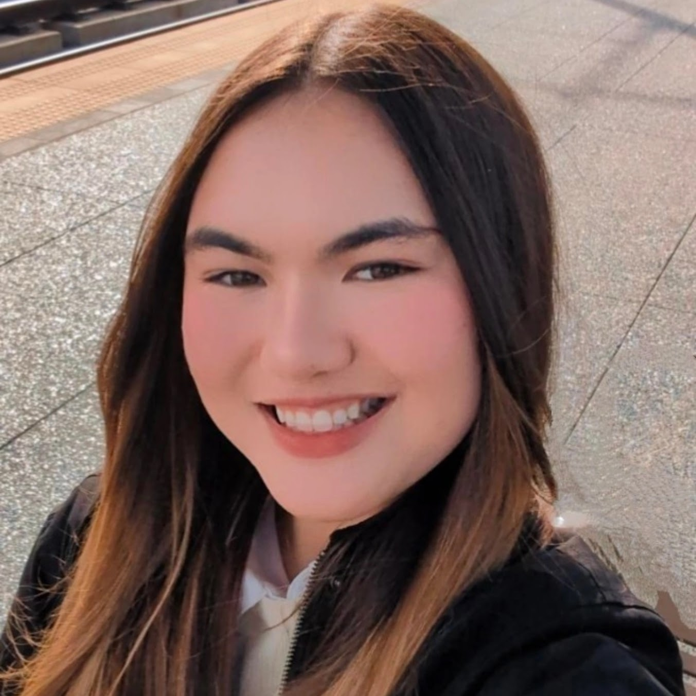

# About Me

### UC San Diego | Prior Systems Integration Intern | Biomedical Engineering Society

Hey! I'm Alisa Kunimoto — a bioengineering student with a mechanical twist.

I’ve worked on everything from 3D-printed devices to coding simulations, and I’m always exploring how engineering can improve world health and advance technology. I'm also an experienced figure skater and flute player, and I take pride in bringing that same energy and discipline to my technical work. 

I also enjoy learning about intellectual property and read patents on my free time! I love listening to engineers and scientists when they explain how they solved a niche problem with a creative solution.

🇯🇵 日本語もオッケーです！ Looking for a someone fluent in Japanese ? 

🧠 Fun Fact: It’s canon lore about me that I worshipped QR codes during my Freshman year of college!
 
---

## 📘 Education
- **University of California, San Diego**
  - B.S. Bioengineering
 
## 💼 Work Experience
- **Systems Integration Intern @ Singular Genomics**
- **Figure Skating Junior Coach @ San Diego Ice Area**

## ⚙️ Skills
- **Programming:** Python (+Jupytr Notebooks), MATLAB (+Simulink), C++
- **CAD:** Fusion 360, SolidWorks
- **Makerspace:** Arduino, 3D Printing, Laser Cutting, Resin Printing, Soldering
- **Image Analysis** ImageJ
- Google Workplace & Microsoft 365 
- Technical Writing, Public Speaking
