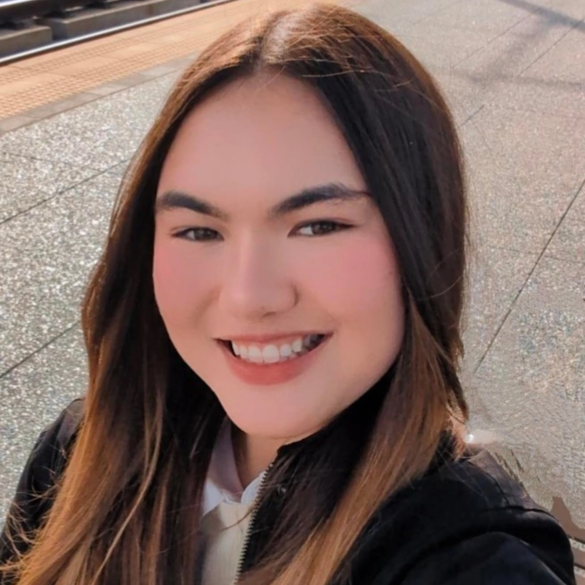

# 👋 Hey, Nice to Meet You! I'm Alisa.

I'm a Bioengineering student at UC San Diego passionate about merging biology, engineering, and code to solve real-world challenges.

🌱 Interests:  
- Medical Devices & Biotechnology
- Mechanical Design  
- Programming & Applications
- Yapping about Patents
- Biopharmacuticals

Feel free to reach out — I'm always open to chatting!

# Contact Info
- [LinkedIn](https://www.linkedin.com/in/alisakunimoto/)
- [Email Me](mailto:alisakunimoto@gmail.com)
- [Github](https://github.com/ari-kuni)

  

  

  

