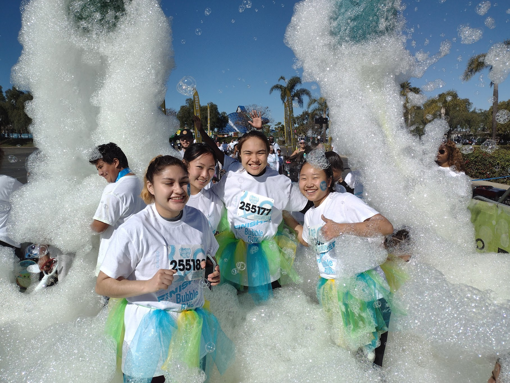

# The Biomedical Engineering Society @ UC San Diego

I'm currently serving as a principle board member for the Biomedical Engineering Society at the UC San Diego branch. I organize weekly committee meetings and I've planned 3 major events with my wonderful team of dedicated and ambitious individuals. We've organized the:
- Switching into Bioengineering Symposium
- Bengathon
- The Bioengineering Experience
  
We've also hosted workshops such as _Coffee Chats with Graduate Students_ and _Course Selection Workshops with Upperclassman_. 

I've also participated in conducting workshops for K-12 students to teach them the intriguing world and STEM. I love mentoring and teaching young individuals, inspiring them to pursue contributing to new innovations. 

<!-- Centered heading text -->

  Learn More By Clicking Below!

  

# San Diego Figure Skating Club, Junior Board

I also served as the President of the San Diego Figure Skating Club, Junior Board. I conducted bi-monthly meetings organizing Beach Clean-ups, Figure Skating Competition volunteering, Summer Mixers, Fundraising Marathons, and Halloween Bake Sales. 

I also established a system of Committee Members allowing more Club Members to participate in board activities and learn technical skills before joining eBoard positions. I solidified this system by hosting one-on-one meetings with my team to elaborate on responsibilities and training for report writing. 

Additionally, I served as Secretary and Tresurer prior to my position as President. This allowed me to better train up-and-coming board members and support my team in board activities. It also provided me with an interdisciplinary perspective of organizations. 

  

  

  

